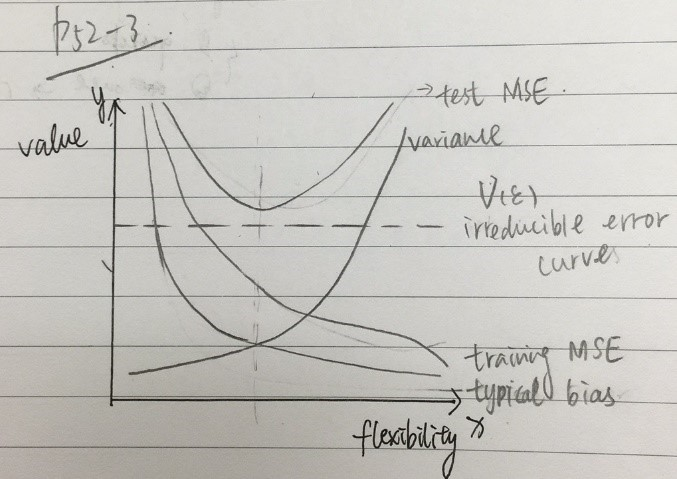

#### Q1-(P52-Q1) 

Solutions: 

(a) A Flexible Method could be better for this situation. Because the extremely large capacity of the sample, it is better to use a more complicated and flexible method to fit the data, which will be more accurate than use an inflexible method under this circumstance. 

(b) An inflexible Method could be better for this situation. Because the observation capacity is much smaller than the predictors, it is better to use a simpler and inflexible method to cater the basic need. The Flexible Method is better to adopt when condition the number of sample (or observation) is equal or larger than the number of predictors, otherwise it will be inefficient and overfitting the data. 

(c) A Flexible Method could be better for this situation. No-linear Relationship (or Regression) means the simple-inflexible method would fail to cater the need of the expression. For a more accurate expression, the Flexible Method with higher degree of freedom would fit the data better. 

(d) Flexible Methods could worsen the situation. With the extremely high variance, A very flexible methods would be fit here and cause the overfitting. An inflexible model here may avoid this situation and get the key features of the data. 


#### Q2-(P52-Q3) 

Solutions:
(a)




(b)Explain: 

For Test Error and Training Error (Corresponding to Test MSE and Training MSE in the figure 1): as the increase of the flexibility, the training MSE will decrease but the test MSE will show a trend of parabola (a>0) above irreducible error (the dash line). That is because as flexibility increases, the f curve fits the observed data (training data) closer; in opposite, a large flexibility will cause Test data an overfitting, so the possibility of error increases after the lowest point. In real case, lower in test MSE is more important than training MSE. 

For Typical bias and Variance: these two curves show the opposite trend. The bias will decrease because a flexible method will fit the sample closer. The variance will increase because a flexible method will overfit. In real case, a Bias-Variance Trade-off should be applied to find the appropriate degree of flexibility. 

 For Irreducible Error: The value of it should remain a constant as it is "irreducible" no matter which model is chosen. And it should be lower than the Test MSE as it is the lowest possible error. 
 
 
 
####Q3-(P53-Q6) 

Solutions: 

The difference between Parametric Method and Non-Parametric Method: Parametric Method reduces the problem of estimating f down to one of estimating a set of parameters. It needs a two-step model to make an assumption about the functional form of f and to uses training data to fit the model. Non-Parametric Method does not make explicit assumptions about the functional form of f and needs a large sample to accurate the estimate f. 

The advantage of using Parametric Method for regression or classification: simplify the problem of estimating f; reduce the requirements for the large sample number comparing to Non-Parametric Methods. the potential disadvantage of the Parametric Method is that the model we choose will usually not match the true unknown form of f, the estimate f might very different from the true f which will cause the resulting model fail to fit the data well.


####Q4

```{r echo = TRUE}
# Author: Tianyu Li
# Created on Jan 21st 2019
# Edited on Jan 28th 2019
#
# R script for Homework 1 Question 4(Section 2.4, page 54-55, question 8)
# The College.csv file should be in working direction 
setwd('Z:/R_working_directory/DS502HW1');

#(a) Read the file
college = read.csv(file = 'College.csv', header = TRUE);

#(b) Give row names
rownames(college) = college[,1];
fix(college);

college = college[,-1];
fix(college);

#(c) i.Summary function
summary(college);

#(c) ii.Pairs function
pairs(college[,1:10]);

#(c) iii.Plot function
boxplot(college$Outstate ~ college$Private, names = c("Public", "Private"),
        ylab = "Out-of-state tuition");

#(c) iv.Factor function
Elite = rep("No", nrow(college));
Elite[college$Top10perc > 50] = "Yes";
Elite = as.factor(Elite);
college = data.frame(college, Elite);

summary(college$Elite);
boxplot(college$Outstate ~ college$Elite, names = c("Non-Elite", "Elite"),
        ylab = "Out-of-state tuition");

#(c) v.Hist function
par(mfrow=c(2,2));

hist(college$Apps, breaks = 40, xlim = range(0, 20000), main = "Applications",
     xlab = "Number of application recieved");
hist(college$Accept, breaks = 20, xlim = range(0, 20000), main = "Admissions",
     xlab = "Number of applicants accepted");
hist(100 * college$Accept / college$Apps, breaks = 20, xlim = range(0, 100),
     main = "Admission Rate", xlab = "Admission rate in %");
hist(100 * college$Enroll / college$Accept, breaks = 20, xlim = range(0, 100),
     main = "Enroll Rate", xlab = "Enroll rate in %");

#(c) vi.Continue exploring
summary(lm(Grad.Rate ~ . , data = college));
# We chose graduate rate as the dependent variable and tried to fit in a linear model of other columns.
# We found that the Number of part-time student is negatively correlated to the graduate rate significantly and 
# the outstate tuition and percent of alumni who donate are postively correlated to the graduate rate significantly.
# Besides, the number of applicants, room and board costs and instructional expenditure per student are
# also correlated to the graduate rate.

```


####Q5

```{r echo = TRUE}
# Author: Tianyu Li
# Created on Jan 28th 2019
# Edited on Jan 29th 2019
#
# R script for Homework 1 Question 5(Section 2.4, page 56, question 9)
# The Auto.csv file should be in working direction 
setwd('Z:/R_working_directory/DS502HW1');

# Read the file
auto = read.csv(file = 'Auto.csv', header = TRUE);

# Remove missing values
auto[auto == '?'] <- NA;
auto = na.omit(auto);
auto$horsepower = as.numeric(as.character(auto$horsepower));

#(a) The last 2 predictors are qualitative, the others are quantative.
#    The "origin" should stands for the continent so it is qualitative.

#(b) Range of each quantitative predictor
sapply(auto[, 1:7], range);

#(c) Mean and standard deviation of each quantitative predictor
sapply(auto[, 1:7], mean);
sapply(auto[, 1:7], sd);

#(d) Remove the 10th through 85th observations.
subAuto = auto[-(10:85),];
sapply(subAuto[, 1:7], range);
sapply(subAuto[, 1:7], mean);
sapply(subAuto[, 1:7], sd);

#(e) Create some plots
pairs(auto[, 1:7]);
# We found that the displacement and weight look postively correlated to the horsepower.

#(f) Predictors that might be useful in predicting mpg
# From the figures of last question, we found that mpg is postively correlated to year and
# negatively correlated to displacement, horsepower and weight. 
boxplot(auto$mpg ~ auto$origin, names = c("America", "Europe", "Japan"), ylab = "mpg", 
        main = "Mpg over Origin");
# We also found that for the origin column, 1 should stands for America, 2 stands for Europe
# and 3 stands for Asia. In general, asian cars is highest on mpg while american cars is lowest.
```


####Q6-(P120-Q1) 

Solutions: 

In this case, we can assume the advertising budgets of TV, Radio and Newspaper do not affect the sales. Multiple Linear Regression Model is


####Q7- (P121-Q5) 

Solutions: 


####Q8- (P121-Q6) 

Solutions: 


####Q9
```{r echo = TRUE}
# Author: Tianyu Li
# Created on Jan 29th 2019
#
# R script for Homework 1 Question 9(Section 3.7, page 121-122, question 8)
# The Auto.csv file should be in working direction 
setwd('Z:/R_working_directory/DS502HW1');

# Read the file
auto = read.csv(file = 'Auto.csv', header = TRUE);

# Remove missing values
auto[auto == '?'] <- NA;
auto = na.omit(auto);
auto$horsepower = as.numeric(as.character(auto$horsepower));

#(a) Perform a simple linear regression
temp = lm(mpg ~ horsepower, data = auto);
summary(temp);
# i Yes
# ii The relationship is strong as the value of R^2 is 0.6059
# iii Negative, the coefficient is -0.157845.
# iv Predict mpg associated with a horsepower of 98
predict(temp, data.frame(horsepower = 98), interval = "confidence");
predict(temp, data.frame(horsepower = 98), interval = "prediction");

#(b) Plot the response and the predictor
par(mfrow=c(1,1));
plot(mpg ~ horsepower, data = auto);
abline(temp, col = 'red');

#(c) Produce diagnostic plots of the least squares regression fit
par(mfrow = c(2, 2))
plot(temp);
# The plots (the first and third one) show that the relationship is non-linear. 
```


###Q10
```{r echo = TRUE}
# Author: Tianyu Li
# Created on Jan 29th 2019
#
# R script for Homework 1 Question 10(Section 3.7, page 122, question 9)
# The Auto.csv file should be in working direction 
setwd('Z:/R_working_directory/DS502HW1');

# Read the file
auto = read.csv(file = 'Auto.csv', header = TRUE);

# Remove missing values
auto[auto == '?'] <- NA;
auto = na.omit(auto);
auto$horsepower = as.numeric(as.character(auto$horsepower));

#(a) Produce a scatterplot matrix
pairs(auto);

#(b) Compute the matrix of correlations
cor(auto[, 1:8]);

#(c) Perform a multiple linear regression with mpg
temp = lm(mpg ~ . - name, data = auto);
summary(temp);
#i Yes, the adjusted R-squared value is 0.8185, which is high.
#ii From the summary table, we may conclude that 'displacement', 'weight',
#   'year', 'origin' have a statistically significant relationship to the response.
#iii It suggests that in average, 0.750773 mpg will increase as a year increase.
#    Which means the fuel efficiency is improving.


#(d) Produce diagnostic plots of the linear regression fit.
par(mfrow=c(2,2));
plot(temp);
# No unusually large outliers are observed. 
# The plot shows that the 14th data have a relatively high leverage.
temp2 = lm(mpg ~ . - name, data = auto[-(14),]);
summary(temp2);
# By removing the 14th data, the R-squared value increase for 0.0006

#(e) Fit linear regression models with interaction effects.
temp3 = lm(mpg ~ . - name + horsepower:weight + horsepower:displacement, data = auto);
summary(temp3);
# The interaction between displacement and horsepower appear to be statistically significant.


#(f) Try a few different transformations of the variables
cor(data.frame(auto$weight, log(auto$weight), sqrt(auto$weight), (auto$weight)^2), auto$mpg);
cor(data.frame(auto$horsepower, log(auto$horsepower), sqrt(auto$horsepower), (auto$horsepower)^2), auto$mpg);
cor(data.frame(auto$cylinders, log(auto$cylinders), sqrt(auto$cylinders), (auto$cylinders)^2), auto$mpg);
cor(data.frame(auto$displacement, log(auto$displacement), sqrt(auto$displacement), (auto$displacement)^2), auto$mpg);
cor(data.frame(auto$acceleration, log(auto$acceleration), sqrt(auto$acceleration), (auto$acceleration)^2), auto$mpg);
cor(data.frame(auto$origin, log(auto$origin), sqrt(auto$origin), (auto$origin)^2), auto$mpg);
cor(data.frame(auto$year, log(auto$year), sqrt(auto$year), (auto$year)^2), auto$mpg);
# Weight, horsepower, displacement, acceleration and origin fit the log transformation best,
# Cylinders fit the square root transformation best and year fit square transfromation best.
```